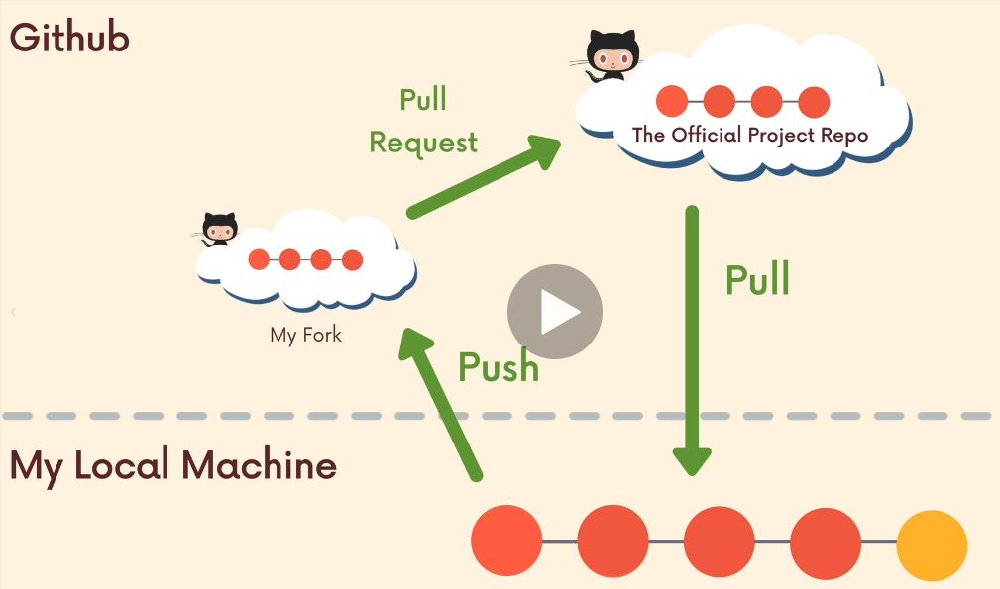

# Fork & Clone #
### Workflow utilizzato solitamente, per contribuire a progetti opensource su github ###

+ Effettuare un fork del progetto a cui vogliamo contribuire
+ Clonare il progetto Github (il nostro fork, non quello ufficiale), su un repo locale.
+ Impostare l'upstream:
  - `git remote -v`
  per vedere i remote attualmente impostati. (Quindi, fetch e push sul nostro fork)
  - `git remote add upstream [URL PROGETTO ORIGINALE]`  così, impostiamo un remote chiamato 'upstream', che punta al progetto originale, e non alla nostra fork.
  - controlliamo nuovamente se è stato correttamente aggiunto con `git remote -v`

+ Ora, per pullare i dati committati sul progetto ufficiale, posso fare:
  - `git pull upstream main`    (Oppure Master?)

+ mentre per pusharli sul mio fork, posso fare:
  - `git push origin main` 

+ Quando ho finito, devo andare su GitHub e fare una Pull-Request, per richiedere al proprietario del progetto originale, di accettare il mio codice.

---
## Esempio ##
(Nella speranza che non sia protetta da Copyright)
